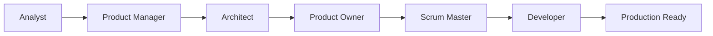

# BMAD-METHOD User Guide

## 🚀 Quick Start

The BMAD-METHOD (Breakthrough Method for Agile AI-Driven Development) is a revolutionary framework that transforms how you build software projects using AI agents. Get started in under 5 minutes!

### Installation

```bash
# Clone the repository
git clone https://github.com/LarsArtmann/BMAD-METHOD.git
cd BMAD-METHOD

# For Web Agent (Recommended)
node build-web-agent.js

# For IDE Integration
cp -r bmad-agent/ /path/to/your/project/
```

### 30-Second Demo

```bash
# 1. Set up the Web Agent (copy agent-prompt.txt to Gemini/ChatGPT)
# 2. Ask: "Help me build a health endpoint API system"
# 3. Watch BMAD agents collaborate to create your complete project!
```

## 🎯 What is BMAD-METHOD?

BMAD-METHOD elevates "vibe coding" to advanced project planning, ensuring your AI developer agents can start and complete sophisticated projects with explicit guidance. It's not just a task runner—it's a refined methodology that helps you:

- **Brainstorm and refine** your best ideas
- **Define precisely** what you need to build  
- **Execute systematically** with AI agent collaboration
- **Deliver production-ready** software consistently

## 🏗️ Core Architecture

### The BMAD Agent Team

BMAD uses specialized AI agents that work together like a real development team:

| Agent | Role | Expertise |
|-------|------|-----------|
| **Larry (Analyst)** | Strategic Ideation | Market research, problem analysis, brainstorming |
| **John (Product Manager)** | Product Strategy | Requirements, user stories, roadmap planning |
| **Mo (Architect)** | Technical Design | System architecture, technology decisions |
| **Product Owner** | Quality Assurance | Validation, acceptance criteria, stakeholder alignment |
| **Scrum Master** | Process Management | Sprint planning, task breakdown, team coordination |
| **Developer** | Implementation | Code quality, testing, technical execution |

### The BMAD Workflow



Each agent builds upon the previous agent's work, creating a comprehensive development pipeline.

## 🌐 Setup Options

### Option 1: Web Agent (Recommended for Beginners)

**Best for:** Quick prototyping, brainstorming, complete project planning

1. **Build the Web Agent:**
   ```bash
   node build-web-agent.js
   ```

2. **Set up in Gemini or ChatGPT:**
   - Copy contents of `web-build-sample/agent-prompt.txt` 
   - Paste into Custom GPT or Gemini Gem instructions
   - Attach all other files from the build folder
   - Save your custom agent

3. **Start building:**
   ```
   /help          # See available commands
   /agents        # View all available personas
   /brainstorm    # Start ideation session
   ```

### Option 2: IDE Integration (For Active Development)

**Best for:** Hands-on development, code implementation, iterative building

1. **Copy BMAD assets to your project:**
   ```bash
   cp -r bmad-agent/ /path/to/your/project/
   ```

2. **Set up IDE agents:**
   - **Windsurf/Cursor:** Use `bmad-agent/personas/dev.ide.md` and `sm.ide.md`
   - **Other IDEs:** Configure custom agents with persona files
   - **Orchestrator:** Use `bmad-agent/ide-bmad-orchestrator.md` for all-in-one

3. **Start developing:**
   - Create `docs/` folder in your project
   - Ask your dev agent to begin with story implementation
   - Use SM agent for sprint planning and task breakdown

## 📚 Usage Patterns

### Pattern 1: Complete Project from Scratch

```bash
# 1. Web Agent: Brainstorming & Planning
"I want to build a health monitoring API system"
→ Analyst creates project brief
→ PM develops detailed requirements  
→ Architect designs technical solution
→ PO validates and approves

# 2. IDE Agent: Implementation
→ SM breaks down into 5-task stories
→ Developer implements incrementally
→ Continuous testing and validation
```

### Pattern 2: Enhance Existing Project

```bash
# Add BMAD to existing project
cp -r bmad-agent/ ./
# Ask dev agent: "Help me add health endpoints to my Go API"
# Follow BMAD methodology for systematic enhancement
```

### Pattern 3: Learning & Exploration

```bash
# Use Web Agent for learning
"/become analyst"
"Help me understand microservices architecture patterns"
# Get expert-level insights and recommendations
```

## 🛠️ Key Features

### 🎨 Intelligent Agent Orchestration

- **Dynamic Persona Switching:** One agent can become any specialist
- **Context Preservation:** Maintains project knowledge across conversations
- **Collaborative Handoffs:** Seamless transitions between development phases

### 📋 Systematic Task Management

- **5-Task Stories:** Every epic broken into exactly 5 manageable tasks
- **10-15 Minute Tasks:** Each task completable in a focused session
- **Quality Gates:** Built-in validation at every step

### 🏗️ Template-Driven Development

- **Progressive Complexity:** Basic → Intermediate → Advanced → Enterprise tiers
- **Production Ready:** Generated code includes monitoring, security, deployment
- **Best Practices:** Embedded industry standards and patterns

### 🔄 Continuous Validation

- **Real-World Testing:** Validation in actual deployment environments
- **Performance Benchmarks:** Measurable quality standards
- **Documentation Excellence:** Comprehensive guides and examples

## 📖 Detailed Workflows

### Web Agent Workflow

1. **Start a Session:**
   ```
   /help                    # Get oriented
   /agents                  # See available personas
   /become analyst          # Start with strategic analysis
   ```

2. **Project Planning:**
   ```
   "I want to build [your project idea]"
   → Analyst: Creates project brief and market analysis
   → PM: Develops detailed requirements and user stories  
   → Architect: Designs technical architecture
   → PO: Validates requirements and creates acceptance criteria
   ```

3. **Implementation Planning:**
   ```
   /become sm               # Switch to Scrum Master
   "Break down the epics into implementable stories"
   → Creates 5-task stories with detailed acceptance criteria
   → Provides sprint planning and dependency mapping
   ```

### IDE Agent Workflow

1. **Project Setup:**
   ```bash
   # Copy BMAD assets
   cp -r bmad-agent/ ./
   mkdir docs docs/stories
   
   # Set up your preferred IDE agent
   # Use dev.ide.md or sm.ide.md content
   ```

2. **Story Implementation:**
   ```
   # Ask your dev agent:
   "Implement story 1: Basic health endpoint setup"
   
   # Agent will:
   → Break into 5 focused changes
   → Implement with testing
   → Validate each step
   → Document progress
   ```

3. **Continuous Development:**
   ```
   # After each story:
   "Review progress and implement next story"
   
   # For planning:
   "Switch to SM mode and plan next sprint"
   ```

## 🎯 Best Practices

### For Web Agent Usage

- **Start with `/help`** to understand available commands
- **Use `/agents`** to see all available personas
- **Be specific** about your project goals and constraints
- **Iterate on requirements** before moving to implementation
- **Save important outputs** to your project documentation

### For IDE Agent Usage

- **Maintain docs/ structure** for artifacts and stories
- **Follow the 5-task rule** for manageable development
- **Test each change** before proceeding
- **Document decisions** and rationale
- **Use quality gates** between development phases

### General Best Practices

- **Trust the process** - BMAD methodology is battle-tested
- **Embrace iteration** - Refine requirements through collaboration
- **Focus on quality** - "Keep going until everything works"
- **Document everything** - Enable knowledge transfer and continuity
- **Validate early** - Test in real environments, not just theory

## 🔧 Configuration & Customization

### Agent Configuration

Customize which agents can perform which tasks by editing:
- `bmad-agent/web-bmad-orchestrator-agent.cfg.md` (Web)
- `bmad-agent/ide-bmad-orchestrator.cfg.md` (IDE)

### Task Customization

Add custom tasks in `bmad-agent/tasks/`:
```markdown
# my-custom-task.md
## Task: Custom Implementation Task
[Your custom instructions here]
```

### Template Customization

Modify templates in `bmad-agent/templates/` for your specific needs:
- Story templates
- Documentation templates  
- Code generation templates

## 🚨 Troubleshooting

### Common Issues

**"Agent seems confused about project context"**
- Provide more specific requirements
- Use the analyst agent to clarify project scope
- Reference existing documentation and artifacts

**"Generated code doesn't compile"**
- Ask dev agent to validate and fix compilation issues
- Ensure all dependencies are properly specified
- Test in clean environment

**"Tasks seem too large or complex"**
- Ask SM agent to break down further
- Follow the 5-task, 10-15 minute rule
- Focus on single responsibility per task

### Getting Help

1. **Use `/help`** in Web Agent for command reference
2. **Check `docs/instruction.md`** for detailed setup instructions
3. **Review `PROJECT_GUIDELINES.md`** for methodology details
4. **Ask agents directly:** "I'm having trouble with [specific issue]"

## 🎓 Learning Resources

### Example Projects

- **template-health-endpoint:** Complete health API system with 4-tier complexity
- **Demo transcripts:** See `demos/readme.md` for real usage examples
- **Full conversation logs:** Available in project documentation

### Key Documents

- `PROJECT_GUIDELINES.md` - Complete methodology reference
- `docs/instruction.md` - Detailed setup and configuration
- `docs/prd.md` - Example of BMAD-generated requirements
- `docs/architecture.md` - Technical architecture examples

### Advanced Topics

- **Multi-agent collaboration patterns**
- **Custom persona development**
- **Enterprise deployment strategies**
- **Integration with existing workflows**

## 🌟 Success Stories

### Template Health Endpoint Project

**Challenge:** Build a comprehensive health endpoint template system
**Solution:** Used BMAD methodology for systematic development
**Results:** 
- 4-tier progressive complexity system
- Production-ready templates with monitoring
- Complete CLI tool and static templates
- Comprehensive testing and validation

**Timeline:** 
- Analysis & Planning: 2 days
- Architecture & Design: 1 day  
- Implementation: 5 days
- Testing & Documentation: 2 days

## 🚀 Next Steps

### For New Users
1. **Try the Web Agent** with a simple project idea
2. **Follow a complete workflow** from analysis to implementation
3. **Experiment with different personas** to understand their strengths
4. **Build something real** using the methodology

### For Advanced Users
1. **Customize agents** for your specific domain
2. **Create custom tasks** for repeated workflows
3. **Integrate with CI/CD** pipelines
4. **Contribute improvements** back to the project

### For Teams
1. **Establish BMAD standards** for your organization
2. **Train team members** on the methodology
3. **Create shared templates** and configurations
4. **Scale across multiple projects**

## 📞 Support & Community

- **GitHub Issues:** Report bugs and request features
- **Discussions:** Share experiences and get help
- **Contributing:** See `docs/CONTRIBUTING.md` for guidelines
- **License:** Open source under project license

---

**Ready to revolutionize your development process?** Start with the Web Agent and experience the power of systematic AI-driven development!

```bash
# Get started now:
git clone https://github.com/LarsArtmann/BMAD-METHOD.git
cd BMAD-METHOD
node build-web-agent.js
# Follow setup instructions above
```
