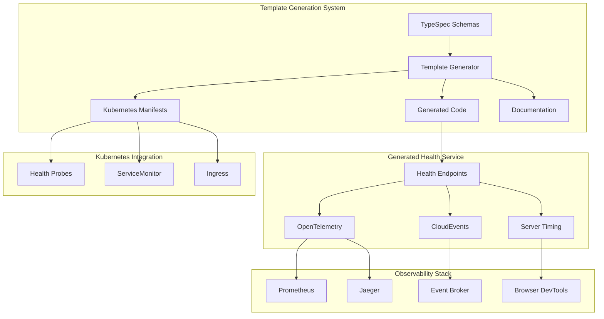
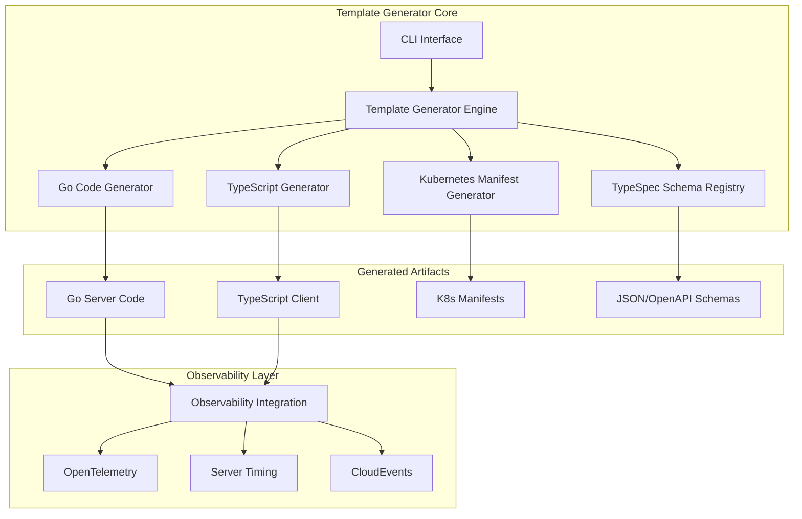
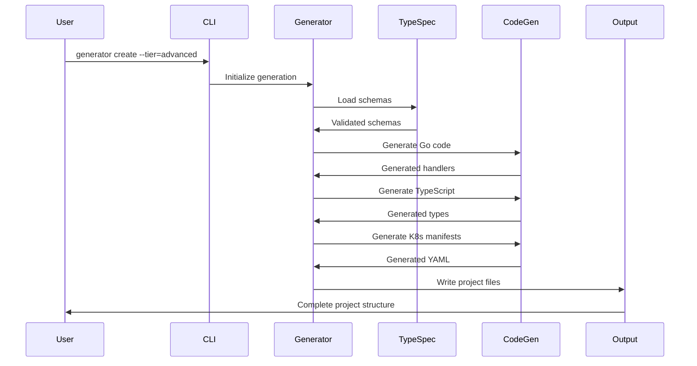
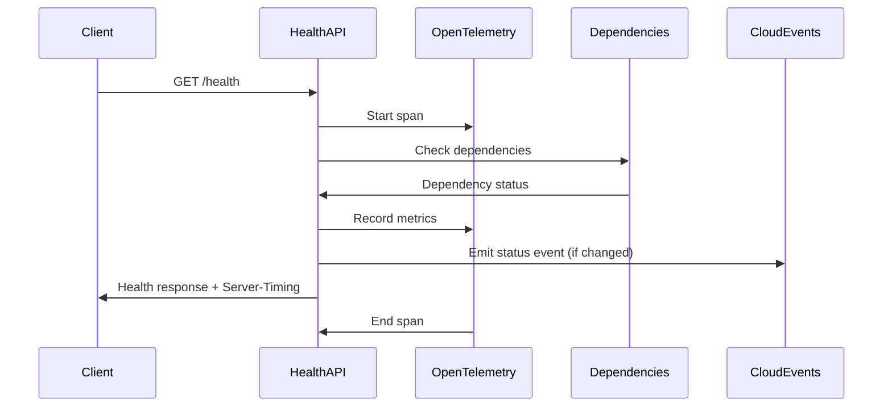

# template-health-endpoint Architecture Document

## Introduction / Preamble

This document outlines the comprehensive technical architecture for the template-health-endpoint project, a TypeSpec-driven health endpoint template generation system. The architecture is designed to support four-tier template generation (Basic → Intermediate → Advanced → Enterprise) with native observability, Kubernetes integration, and event-driven capabilities.

**Primary Goal:** Establish a robust, scalable template generation system that produces production-ready health endpoints with comprehensive observability and cloud-native integration patterns.

**Relationship to Frontend Architecture:** This project is primarily a developer-focused template system with no traditional UI requirements. All interactions occur through CLI tools and generated code artifacts.

## Table of Contents

1. [Technical Summary](#technical-summary)
2. [High-Level Overview](#high-level-overview)
3. [Architectural / Design Patterns Adopted](#architectural--design-patterns-adopted)
4. [Component View](#component-view)
5. [Project Structure](#project-structure)
6. [Data Models & Schemas](#data-models--schemas)
7. [API Design](#api-design)
8. [Integration Architecture](#integration-architecture)
9. [Security Architecture](#security-architecture)
10. [Core Workflow / Sequence Diagrams](#core-workflow--sequence-diagrams)
11. [Definitive Tech Stack Selections](#definitive-tech-stack-selections)

## Technical Summary

The template-health-endpoint system employs a **Template Generation Architecture** with TypeSpec-first development, producing multi-tier health endpoint implementations. The system uses a Go-based generator that processes TypeSpec schemas to create comprehensive health endpoint templates with native OpenTelemetry integration, Server Timing API support, CloudEvents emission, and Kubernetes-ready configurations.

The architecture follows **Domain-Driven Design** principles with clear separation between template generation, code generation, and observability concerns. Each generated template tier provides progressive complexity while maintaining consistent patterns and interfaces.

## High-Level Overview

**Architectural Style:** Template Generation System with Code Generation Pipeline
**Repository Structure:** Standalone template repository (polyrepo) generating individual microservice templates
**Primary Data Flow:** TypeSpec Schemas → Template Generator → Generated Code (Go/TS) → Kubernetes Manifests → Deployed Health Endpoints



## Architectural / Design Patterns Adopted

- **Template Generation Pattern** - _Rationale:_ Enables consistent, repeatable health endpoint implementations across different complexity tiers while maintaining flexibility for customization
- **Schema-First Development (TypeSpec)** - _Rationale:_ Ensures type safety, automatic documentation generation, and consistent API contracts across Go and TypeScript implementations
- **Progressive Complexity Tiers** - _Rationale:_ Allows developers to start simple and upgrade as needs grow, following iterative development principles
- **Observability-First Design** - _Rationale:_ Native integration of OpenTelemetry, Server Timing, and CloudEvents ensures comprehensive monitoring from the start
- **Cloud-Native Patterns** - _Rationale:_ Built-in Kubernetes integration, health probes, and service mesh compatibility for modern deployment environments
- **Event-Driven Architecture** - _Rationale:_ CloudEvents integration enables reactive monitoring and alerting based on health status changes
- **Dependency Injection** - _Rationale:_ Generated code uses DI patterns for testability and modularity
- **Circuit Breaker Pattern** - _Rationale:_ Implemented in intermediate+ tiers for resilient dependency health checks

## Component View

### Core Components

**Template Generator Engine**
- Responsibility: Processes TypeSpec schemas and generates multi-tier templates
- Key Functions: Schema validation, code generation orchestration, template customization
- Interfaces: CLI commands, configuration files, TypeSpec compiler integration

**TypeSpec Schema Registry**
- Responsibility: Maintains canonical health endpoint schema definitions
- Key Functions: Schema versioning, validation, cross-tier compatibility
- Interfaces: TypeSpec files, JSON Schema output, OpenAPI v3 generation

**Go Code Generator**
- Responsibility: Generates Go server implementations from TypeSpec schemas
- Key Functions: Struct generation, HTTP handler creation, middleware integration
- Interfaces: TypeSpec input, Go source output, test file generation

**TypeScript Generator**
- Responsibility: Creates TypeScript types and client SDKs
- Key Functions: Interface generation, client SDK creation, type validation
- Interfaces: TypeSpec input, TypeScript output, npm package structure

**Kubernetes Manifest Generator**
- Responsibility: Produces Kubernetes deployment configurations
- Key Functions: Health probe configs, ServiceMonitor creation, Ingress setup
- Interfaces: Template configuration, YAML manifests, Helm charts

**Observability Integration Layer**
- Responsibility: Embeds OpenTelemetry, Server Timing, and CloudEvents
- Key Functions: Trace generation, metrics collection, event emission
- Interfaces: Generated middleware, configuration templates, monitoring dashboards



## Project Structure

```
template-health-endpoint/
├── cmd/
│   └── generator/                   # CLI template generator
│       ├── main.go                  # Main CLI entry point
│       ├── commands/                # CLI command implementations
│       │   ├── generate.go          # Template generation command
│       │   ├── validate.go          # Schema validation command
│       │   └── upgrade.go           # Tier upgrade command
│       └── config/                  # CLI configuration
│           ├── config.go            # Configuration management
│           └── templates.yaml       # Template tier definitions
├── pkg/
│   ├── schemas/                     # TypeSpec schema definitions
│   │   ├── health/                  # Core health schemas
│   │   │   ├── health.tsp           # Basic health status models
│   │   │   ├── server-time.tsp      # ServerTime API models
│   │   │   ├── dependencies.tsp     # Dependency health models
│   │   │   └── metrics.tsp          # Metrics and timing models
│   │   ├── observability/           # Observability schemas
│   │   │   ├── opentelemetry.tsp    # OpenTelemetry integration
│   │   │   ├── server-timing.tsp    # Server Timing API models
│   │   │   └── cloudevents.tsp      # CloudEvents schemas
│   │   └── kubernetes/              # Kubernetes integration schemas
│   │       ├── probes.tsp           # Health probe configurations
│   │       └── monitoring.tsp       # ServiceMonitor schemas
│   ├── generator/                   # Code generation engines
│   │   ├── core/                    # Core generation logic
│   │   │   ├── engine.go            # Main generation engine
│   │   │   ├── template.go          # Template processing
│   │   │   └── validation.go        # Generation validation
│   │   ├── golang/                  # Go code generation
│   │   │   ├── generator.go         # Go code generator
│   │   │   ├── handlers.go          # HTTP handler generation
│   │   │   ├── middleware.go        # Middleware generation
│   │   │   ├── models.go            # Struct generation
│   │   │   └── client.go            # Client SDK generation
│   │   ├── typescript/              # TypeScript generation
│   │   │   ├── generator.go         # TypeScript generator
│   │   │   ├── interfaces.go        # Interface generation
│   │   │   ├── client.go            # Client SDK generation
│   │   │   └── types.go             # Type definition generation
│   │   └── kubernetes/              # Kubernetes manifest generation
│   │       ├── generator.go         # Manifest generator
│   │       ├── probes.go            # Health probe generation
│   │       ├── monitoring.go        # ServiceMonitor generation
│   │       └── ingress.go           # Ingress generation
│   ├── templates/                   # Template definitions
│   │   ├── basic/                   # Basic tier templates
│   │   │   ├── config.yaml          # Basic tier configuration
│   │   │   ├── golang/              # Go templates
│   │   │   ├── typescript/          # TypeScript templates
│   │   │   └── kubernetes/          # K8s templates
│   │   ├── intermediate/            # Intermediate tier templates
│   │   ├── advanced/                # Advanced tier templates
│   │   └── enterprise/              # Enterprise tier templates
│   └── observability/               # Observability integration
│       ├── opentelemetry/           # OpenTelemetry integration
│       │   ├── tracing.go           # Tracing setup
│       │   ├── metrics.go           # Metrics collection
│       │   └── logging.go           # Structured logging
│       ├── server-timing/           # Server Timing API
│       │   ├── middleware.go        # Timing middleware
│       │   └── collector.go         # Timing data collection
│       └── cloudevents/             # CloudEvents integration
│           ├── emitter.go           # Event emission
│           ├── schemas.go           # Event schemas
│           └── handlers.go          # Event handling
├── examples/                        # Generated example projects
│   ├── basic-go-service/            # Basic tier Go example
│   ├── intermediate-ts-client/      # Intermediate TypeScript example
│   ├── advanced-observability/      # Advanced tier with full observability
│   └── enterprise-k8s/              # Enterprise Kubernetes deployment
├── docs/                            # Documentation
│   ├── project-brief.md             # Project requirements
│   ├── prd.md                       # Product requirements document
│   ├── architecture.md              # This document
│   ├── api-reference.md             # Generated API documentation
│   ├── setup-guide.md               # Setup and usage instructions
│   ├── tier-comparison.md           # Template tier comparison
│   └── integration-guides/          # Integration documentation
│       ├── kubernetes.md            # Kubernetes integration
│       ├── opentelemetry.md         # OpenTelemetry setup
│       ├── server-timing.md         # Server Timing API usage
│       └── cloudevents.md           # CloudEvents integration
├── scripts/                         # Build and utility scripts
│   ├── build.sh                     # Build script
│   ├── generate-examples.sh         # Example generation
│   ├── validate-schemas.sh          # Schema validation
│   └── test-integration.sh          # Integration testing
├── tests/                           # Test suites
│   ├── unit/                        # Unit tests
│   ├── integration/                 # Integration tests
│   ├── e2e/                         # End-to-end tests
│   └── fixtures/                    # Test fixtures and data
├── .github/                         # GitHub workflows
│   └── workflows/                   # CI/CD pipelines
│       ├── build.yml                # Build and test
│       ├── validate-schemas.yml     # Schema validation
│       └── generate-examples.yml    # Example generation
├── Dockerfile                       # Container build
├── go.mod                           # Go module definition
├── go.sum                           # Go dependency checksums
└── README.md                        # Project overview
```

### Key Directory Descriptions

- **cmd/generator/**: CLI tool for template generation with tier selection and customization
- **pkg/schemas/**: TypeSpec schema definitions organized by domain (health, observability, kubernetes)
- **pkg/generator/**: Code generation engines for Go, TypeScript, and Kubernetes manifests
- **pkg/templates/**: Template definitions for each tier with progressive complexity
- **pkg/observability/**: Observability integration components (OpenTelemetry, Server Timing, CloudEvents)
- **examples/**: Generated example projects demonstrating each template tier
- **docs/**: Comprehensive documentation including setup guides and integration instructions

## Data Models & Schemas

### Core Health Models (TypeSpec)

```typescript
// health.tsp - Core health status models
import "@typespec/http";
import "@typespec/rest";
import "@typespec/openapi3";

using TypeSpec.Http;
using TypeSpec.Rest;

@service({
  title: "Health API",
  version: "1.0.0",
})
namespace HealthAPI;

model HealthStatus {
  /** Health status indicator */
  status: "healthy" | "unhealthy" | "degraded";
  /** Current timestamp in RFC3339 format */
  timestamp: utcDateTime;
  /** Service version */
  version: string;
  /** Service uptime duration */
  uptime: duration;
  /** Server timing metrics */
  serverTiming?: ServerTimingMetrics;
  /** OpenTelemetry trace ID */
  traceId?: string;
  /** Dependency health status */
  dependencies?: DependencyStatus[];
}

model ServerTime {
  /** Current server timestamp in RFC3339 format */
  timestamp: utcDateTime;
  /** Server timezone (e.g., "UTC", "America/New_York") */
  timezone: string;
  /** Unix timestamp in seconds */
  unix: int64;
  /** Unix timestamp in milliseconds */
  unixMilli: int64;
  /** ISO 8601 formatted timestamp */
  iso8601: string;
  /** Human-readable format */
  formatted: string;
  /** Server timing metrics */
  serverTiming?: ServerTimingMetrics;
  /** OpenTelemetry trace ID */
  traceId?: string;
}

model ServerTimingMetrics {
  /** Database query time in milliseconds */
  dbQuery?: float64;
  /** Cache lookup time in milliseconds */
  cacheHit?: float64;
  /** Total processing time in milliseconds */
  total?: float64;
  /** External API call time in milliseconds */
  externalApi?: float64;
}

model DependencyStatus {
  /** Dependency name */
  name: string;
  /** Dependency status */
  status: "healthy" | "unhealthy" | "degraded";
  /** Response time in milliseconds */
  responseTime?: float64;
  /** Error message if unhealthy */
  error?: string;
  /** Last check timestamp */
  lastCheck: utcDateTime;
}
```

### CloudEvents Integration Models

```typescript
// cloudevents.tsp - CloudEvents schema definitions
model HealthEvent {
  /** CloudEvents specification version */
  specversion: "1.0";
  /** Event type */
  type: "com.example.health.status.changed";
  /** Event source */
  source: string;
  /** Event ID */
  id: string;
  /** Event time */
  time: utcDateTime;
  /** Event data content type */
  datacontenttype: "application/json";
  /** Event data */
  data: HealthStatusChangeData;
}

model HealthStatusChangeData {
  /** Current health status */
  status: "healthy" | "unhealthy" | "degraded";
  /** Previous health status */
  previousStatus: "healthy" | "unhealthy" | "degraded";
  /** Change timestamp */
  timestamp: utcDateTime;
  /** Change reason */
  reason?: string;
  /** OpenTelemetry trace ID */
  traceId?: string;
  /** Affected dependencies */
  dependencies?: string[];
}
```

## API Design

### Health Endpoint Interface

```typescript
// API interface definitions
@route("/health")
interface Health {
  /** Basic health check */
  @get check(): HealthStatus;
  
  /** Server time information */
  @get @route("/time") serverTime(): ServerTime;
  
  /** Readiness probe */
  @get @route("/ready") readiness(): HealthStatus;
  
  /** Liveness probe */
  @get @route("/live") liveness(): HealthStatus;
  
  /** Dependency health checks (Intermediate+ tiers) */
  @get @route("/dependencies") dependencies(): DependencyStatus[];
}
```

### Generated Go Handler Pattern

```go
// Generated Go handler structure
type HealthHandler struct {
    tracer   trace.Tracer
    meter    metric.Meter
    logger   *slog.Logger
    deps     []DependencyChecker
    version  string
    startTime time.Time
}

func (h *HealthHandler) CheckHealth(w http.ResponseWriter, r *http.Request) {
    ctx, span := h.tracer.Start(r.Context(), "health.check")
    defer span.End()
    
    start := time.Now()
    defer func() {
        duration := time.Since(start)
        h.addServerTiming(w, ServerTimingMetrics{
            Total: float64(duration.Nanoseconds()) / 1e6,
        })
    }()
    
    status := h.buildHealthStatus(ctx)
    h.writeJSONResponse(w, status)
}
```

## Integration Architecture

### OpenTelemetry Integration

**Tracing Strategy:**
- Automatic span creation for all health endpoints
- Trace ID propagation in responses
- Custom attributes for health status and dependencies
- Integration with distributed tracing systems (Jaeger, Zipkin)

**Metrics Collection:**
- Health check response times
- Dependency check success/failure rates
- Health status change frequency
- Request volume and error rates

**Logging Integration:**
- Structured logging with trace correlation
- Health status change events
- Dependency failure notifications
- Performance degradation alerts

### Server Timing API Integration

**Implementation Pattern:**
```go
func (h *HealthHandler) addServerTiming(w http.ResponseWriter, metrics ServerTimingMetrics) {
    var timings []string
    if metrics.DBQuery > 0 {
        timings = append(timings, fmt.Sprintf(`db;dur=%.1f;desc="Database query"`, metrics.DBQuery))
    }
    if metrics.CacheHit > 0 {
        timings = append(timings, fmt.Sprintf(`cache;dur=%.1f;desc="Cache lookup"`, metrics.CacheHit))
    }
    if len(timings) > 0 {
        w.Header().Set("Server-Timing", strings.Join(timings, ", "))
    }
}
```

### CloudEvents Integration

**Event Emission Strategy:**
- Health status change events
- Dependency failure/recovery events
- Performance degradation alerts
- Service startup/shutdown events

**Event Schema Compliance:**
- CloudEvents v1.0 specification
- Consistent event types and sources
- Structured event data with trace correlation
- Integration with event brokers (NATS, Kafka, etc.)

### Kubernetes Integration

**Health Probe Configuration:**
```yaml
# Generated health probe configuration
livenessProbe:
  httpGet:
    path: /health/live
    port: 8080
  initialDelaySeconds: 30
  periodSeconds: 10
  timeoutSeconds: 5
  failureThreshold: 3

readinessProbe:
  httpGet:
    path: /health/ready
    port: 8080
  initialDelaySeconds: 5
  periodSeconds: 5
  timeoutSeconds: 3
  failureThreshold: 3
```

**ServiceMonitor Integration:**
```yaml
# Generated Prometheus ServiceMonitor
apiVersion: monitoring.coreos.com/v1
kind: ServiceMonitor
metadata:
  name: health-api-monitor
spec:
  selector:
    matchLabels:
      app: health-api
  endpoints:
  - path: /health
    port: http
    interval: 30s
  - path: /metrics
    port: metrics
    interval: 15s
```

## Security Architecture

### Authentication & Authorization
- Optional JWT token validation for enterprise tier
- API key authentication for sensitive health endpoints
- Role-based access control for administrative functions

### Rate Limiting
- Configurable rate limiting for health endpoints
- DDoS protection patterns
- Circuit breaker implementation for dependency checks

### Data Protection
- No sensitive information in health responses
- Secure logging practices
- Audit trail for health endpoint access

## Core Workflow / Sequence Diagrams

### Template Generation Workflow



### Health Check Request Flow



## Definitive Tech Stack Selections

| Category | Technology | Version | Rationale |
|----------|------------|---------|-----------|
| **Schema Definition** | TypeSpec | Latest | API-first development, automatic code generation |
| **Primary Language** | Go | 1.21+ | Performance, concurrency, cloud-native ecosystem |
| **Client Language** | TypeScript | 5.0+ | Type safety, frontend integration |
| **HTTP Framework** | Go net/http | Standard | Simplicity, performance, standard library |
| **Observability** | OpenTelemetry Go SDK | Latest | Industry standard, vendor-neutral |
| **Event System** | CloudEvents Go SDK | Latest | Event-driven architecture standard |
| **Container Runtime** | Docker | Latest | Standardized containerization |
| **Orchestration** | Kubernetes | 1.25+ | Cloud-native deployment standard |
| **Monitoring** | Prometheus | Latest | Metrics collection and alerting |
| **Tracing** | Jaeger | Latest | Distributed tracing visualization |
| **Testing Framework** | Go testing + Testcontainers | Latest | Comprehensive testing with real dependencies |
| **Build System** | Go modules + Make | Latest | Dependency management and build automation |
| **Documentation** | Markdown + Mermaid | Latest | Clear documentation with diagrams |

### Technology Selection Rationale

**TypeSpec Selection:**
- Chosen for API-first development approach
- Automatic generation of JSON Schema, OpenAPI v3, and code
- Strong typing across multiple languages
- Growing ecosystem with Microsoft backing

**Go Selection:**
- Excellent performance for health endpoints
- Strong concurrency model for dependency checks
- Extensive cloud-native ecosystem
- Simple deployment and operations

**OpenTelemetry Selection:**
- Industry standard for observability
- Vendor-neutral approach
- Comprehensive instrumentation capabilities
- Strong Go SDK support

**Kubernetes Selection:**
- De facto standard for container orchestration
- Native health probe support
- Extensive monitoring ecosystem
- Cloud provider compatibility

This architecture provides a robust foundation for generating production-ready health endpoints with comprehensive observability and cloud-native integration capabilities.
